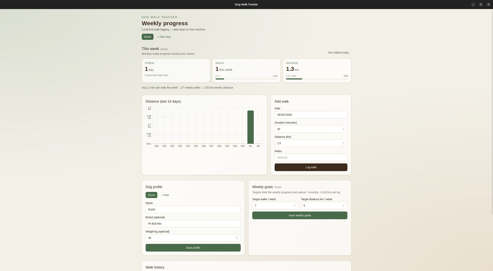

# Dog Walk Tracker

A lightweight, local-first desktop app for logging dog walks and visualizing consistency over time.

**Version:** 1.0.0  
**Privacy:** All data is stored locally in SQLite on your machine. Nothing is sent to external servers.



## Stack

- [Tauri v2](https://v2.tauri.app) + Rust
- React + TypeScript (Vite)
- Tailwind CSS
- SQLite via `tauri-plugin-sql`
- Zustand for UI state

## Install

There are no pre-built GitHub releases yet — install by building on your machine (see [Build from source](#build-from-source)) or use an installer artifact someone gave you from `src-tauri/target/release/bundle/`.

### Linux

After `npm run tauri:build`, installers are under `src-tauri/target/release/bundle/`.

**Debian / Ubuntu (.deb)** — integrates with your app menu and supports upgrades:

```bash
cd src-tauri/target/release/bundle/deb
sudo dpkg -i "./Dog Walk Tracker_1.0.0_amd64.deb"
# If dpkg reports missing dependencies:
sudo apt-get install -f
```

Or with `apt` (must include `./` and quote the whole path — spaces in the filename will break the command otherwise):

```bash
sudo apt install "./Dog Walk Tracker_1.0.0_amd64.deb"
```

Launch **Dog Walk Tracker** from your desktop environment’s app launcher, or run `dog-walk-tracker` from a terminal.

**AppImage** — portable, no system install; good for trying the app once:

```bash
cd src-tauri/target/release/bundle/appimage
chmod +x "Dog Walk Tracker_"*.AppImage
./"Dog Walk Tracker_"*.AppImage
```

To keep it on your system, move the AppImage somewhere on your `PATH` (e.g. `~/Applications/`) and optionally [integrate it with your desktop](https://docs.appimage.org/user-guide/run-appimages.html).

**Fedora / RHEL (.rpm)**:

```bash
cd src-tauri/target/release/bundle/rpm
sudo rpm -i "Dog Walk Tracker-"*.rpm
```

### Windows

Build on Windows, then open `src-tauri\target\release\bundle\`:

- **MSI (recommended):** double-click `msi\Dog Walk Tracker_*.msi` and follow the installer.
- **NSIS setup:** run `nsis\Dog Walk Tracker_*-setup.exe` if present.

The app appears in the Start menu as **Dog Walk Tracker**.

### macOS

Build on macOS. Artifacts are under `src-tauri/target/release/bundle/`:

- **DMG:** open `dmg/Dog Walk Tracker_*.dmg`, drag **Dog Walk Tracker** into Applications.
- **`.app` bundle:** `macos/Dog Walk Tracker.app` — drag to Applications or run from Finder.

On first launch, macOS may block the app (unsigned build). Open **System Settings → Privacy & Security** and choose **Open Anyway**, or right-click the app → **Open**.

### First launch

1. Open **Dog Walk Tracker** — no account or network setup.
2. Add your first dog on the onboarding screen.
3. Your data is stored locally in a SQLite file (`dogwalk.db`) in the app data folder:
   - **Linux:** `~/.local/share/com.dogwalk.tracker/`
   - **macOS:** `~/Library/Application Support/com.dogwalk.tracker/`
   - **Windows:** `%APPDATA%\com.dogwalk.tracker\`

Use **Settings → Export backup** before uninstalling or clearing data.

### Uninstall

| Platform | How |
| --- | --- |
| Linux (.deb) | `sudo apt remove dog-walk-tracker` (or your package manager’s equivalent) |
| Linux (AppImage) | Delete the `.AppImage` file |
| Windows | **Settings → Apps → Installed apps** → uninstall **Dog Walk Tracker** |
| macOS | Drag **Dog Walk Tracker** from Applications to Trash |

Uninstalling does not remove your local database unless you delete the app data folder above (export a JSON backup first if you might reinstall).

## Build from source

You need to build on the OS you plan to run on (cross-compilation is not configured).

### Prerequisites

- [Node.js](https://nodejs.org/) 18+
- [Rust](https://rustup.rs) (stable)
- [Tauri platform dependencies](https://v2.tauri.app/start/prerequisites/) for your OS

On Ubuntu/Debian, the Tauri Linux deps are typically:

```bash
sudo apt update
sudo apt install libwebkit2gtk-4.1-dev build-essential curl wget file \
  libxdo-dev libssl-dev libayatana-appindicator3-dev librsvg2-dev
```

### Build an installer

```bash
git clone https://github.com/jimjamscott22/DogWalk-Visualizer.git
cd DogWalk-Visualizer
npm install
npm run tauri:build
```

The first build downloads Rust crates and compiles the backend — it can take several minutes. When it finishes, installers are in `src-tauri/target/release/bundle/` (see [Install](#install) above).

### Run in development (no installer)

```bash
npm install
npm run tauri dev
```

Hot-reloads the UI; useful for contributors, not required for normal use.

## Test

```bash
npm test                 # Vitest (stats + UI smoke)
cd src-tauri && cargo test
```

## Project layout

```
docs/                 Spec, plan, security audit, release notes
src/                  React frontend
src/lib/db.ts         SQLite access via Tauri SQL plugin
src/store/            Zustand store
src-tauri/            Rust / Tauri backend + migrations
CHANGELOG.md          Version history
```

## Docs

| Doc | Purpose |
| --- | --- |
| [`docs/HANDOFF.md`](docs/HANDOFF.md) | Resume / current status |
| [`docs/RELEASE_NOTES.md`](docs/RELEASE_NOTES.md) | v1.0 release notes |
| [`docs/SECURITY.md`](docs/SECURITY.md) | Permissions & audit |
| [`docs/spec.md`](docs/spec.md) | Product spec |
| [`CHANGELOG.md`](CHANGELOG.md) | Changelog |

## Features (v1.0)

- Dog profiles (name, breed, weight)
- Walk CRUD with validation
- Weekly progress, streak, goals, 14-day chart
- Dark mode, JSON backup, clear-all-data
- Local SQLite only (no cloud)
